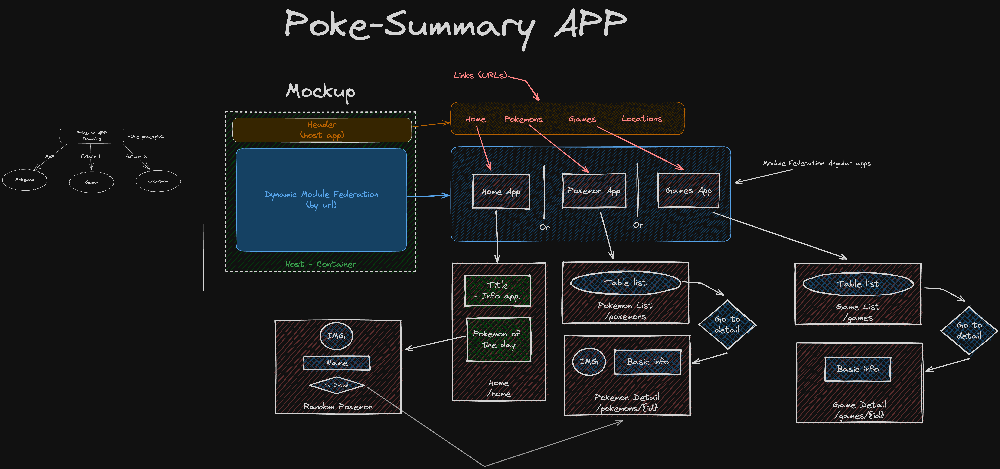

# Pokemon Summary APP

This project contains an example application for learning implementation of microfrontends using module federation and Angular. It consumes the open Pokeapi for consulting data and distribute different domains into individual applications.

## Table of Contents

1. [Architecture](#architecture)

- [Host app](#host)
- [Home app](#home)
- [Pokemons app](#pokemons)
- [Games app](#games)
- [Config api](#config-api)

2. [Api](#api)

3. [Models](#models)

- [Pokemon Model](#pokemon-model)
- [Game Model](#game-model)

4. [Development](#development)

- [Steps](#steps)
  - [Installation](#installation)
  - [Run](#run)
- [Test](#test)

5. [Deploy Docker Stack](#deploy-docker-stack)

6. [Netlify Deploy](#netlify-deploy)

## Architecture



The idea of the development of this project is to create a web host application splitted in two parts:

- A root app that asumes the role of a container who organize and declare all the microfrontends that will be included in the project.
- Some micro applications that represents each functional domain that envolves the business logic, these apps will be considered as microfrontends contained inside the root _host_ app.
  - **Note:** In the first release version it will be develop three microfrontends: a Dashboard (home initial page), a Pokemon module and a Games module.

In this project the microfrontend architecture will be implemented in **vertical** aproach, it consist in it will be only one microfrontend per page and per business domain. To acomplish this goal the project will use Angular for each app (host and microfrontends) and implementing as the microfrontend technology tier the [Module Federation](https://www.npmjs.com/package/@angular-architects/module-federation) plugin developed by angular-architects team.

Other feature that is included in this project is handling a shared library between apps, and using module federation making ths library instantiating itself only once, fulfilling the **singleton** pattern.

## Host

The host application has the layout of the web page, it includes a header menú to navigate
into each microfront (each federated app has a exlusive url domain, ex: app.com/home, app.com/pokemon).

The effort in this app is put all the config needed to apply module federation and dynamic module load.

## Home

The Home application contains one page component that displays the app title and some info, also it includes a dumb component to render a random pokemon of the day. This feature implies the follow:

- Save in localstorage a variable of the last day that the user visited the web page.
- If the last date is different than today, it will generate a random number for look a pokemon and show a preview.

## Pokemons

The Pokemons application contains two page components that displays a table list of pokemon name, number and a button to go to the pokemon's detail, and the second page is the pokemon detail page, it has some basic info and a picture.

## Games

The Games application contains two pages as Pokemons app, but in this context it works with the Game Model, displaying a table list of pokemon games per release, and a detail page that show some basic info of that pokemon game release.

## Config api

In this project it is also included a simple python api builded with FastApi that meets the role of _config server_ for the host container, this api serves a resource json data that has all the metadata needed for the host container to registry, load and import all the microfrontends.

The api use a _mf.manifest.json_ file to serve the response, it uses

# Api

This project uses the [Pokeapi](https://pokeapi.co/) public web api. This api provides many resources related of the famous Pokemon VideoGames and Anime series saga, those reosurces include pokemon entity info, abilities, locations, generations, etc.

The principal resource that is consumed in this project is the entity _Pokemon_, with its list and detail requests.

# Models

## Pokemon Model

This entity represents the creatures called Pokemons, a more detailed description is provided by the api doc page:
_Pokémon are the creatures that inhabit the world of the Pokémon games. They can be caught using Pokéballs and trained by battling with other Pokémon. Each Pokémon belongs to a specific species but may take on a variant which makes it differ from other Pokémon of the same species, such as base stats, available abilities and typings._ [Pokemon](https://pokeapi.co/docs/v2#pokemon).

This Model is used in two microfronts: Home and Pokemons.

## Game Model

This entity represents a release game of the saga, commonly grouped by two main games per release. Each game belongs to a generation in the Pokemon universe and each game group can hold one or two games. [Games](https://pokeapi.co/docs/v2#games-section)

# Development

To run this project locally it needs:

- NodeJS, _LTS version preferably_
- Python3, _It's recommended to create a virtual environment inside the api folder_

## Steps

### Installation

In the root folder of the project run:

```sh
npm install
```

It'll install all the required modules to serve the Angular apps.

If you want to use the python api to serve the microfrontends manifest run in the /api folder:

```sh
pip install -f requirements.txt
```

_Remember that it's recommended to use a virtualenv_

### Run

In development the host container app use as module federation config a json file served in its assets _mf.manifest.json_ and it's declared its usage in the **environment** variable file. So it's not need to serve the config api.

But if you want to use the config api go to the api folder and type:

```sh
uvicorn main:app --reload --port 3000
```

_You need to change the variable mfConfigUrl, instead of the deafult value '/assets/mf.manifest.json' change it with: 'http://localhost:3000'_

Then, to serve the frontend project run:

```sh
npm run run:all
```

This command was provided by the module federation package, it automatically detects the apps in the project (host and microfrontends) and run a basic ng serve for each app.

## Test

All the frontend apps have unit tests to validate the expected behavior for each module and features. There are scripts to run each app test with coverage, for this run:

```sh
npm run test:${app}
```

Where **${app}** will be: host, home, pokemons, games. In the console at the end shows a coverage table and a summary of the suits executions.

In this project it was replaced the default unit test runner and suite, in Angular the default is jasmine as unit test suite and karma as test-runner. But in this project it is implemented Jest, it's a modern test-runner/test-suite environment that brings two killer features:

- No local browser execution, karma to run each test suite needs to open a new browser window, this has some disadvantages as slow execution times and more configuration. Jest uses a virtual dom where test are executed, it's more efficient in time and resources, no difficult configuration is needed and is more friendly with server executions or CI pipelines.
- karma/jasmine run one test per time, tied to the "mono thread" condition of javascript, but Jest can run parallel tests using different proccess executions with more threads, this considerably reduces the general execution time.
- Jest has the same syntax to declare, assert and validate test as jasmine, so it's little noticeable the technologicall change.

# Deploy Docker Stack

This project also has a docker compose stack ready to be builded and executed, it declares one service for each feature, including the config api. As this part intends to be a representation of a production context deployment, the microfrontends and its host angular projects are builded with _ng build_ and its static generated files are exposed by a **nginx** server individually; The project has a common Dockerfile that is reused in the image build step for each Angular app, it uses an ARG variable that is declared in the stack definition.

For the config api there is also a Dockerfile in the /api folder that executes with a **python:alpine** image the installation of the requirements and execute a _Uvicorn_ server.

The frontend common Dockerfile use the **node:lts-alpine** and **nginx:1.25.2-alpine** images.

To create the Docker Compose Stack run:

```sh
docker compose up --build -d
```

The Stack exposes these ports:

- Host App is in 8000
- Home App is in 8001
- Pokemons App is in 8002
- Games App is in 8003
- Config api is in 3000

## Important considerations

When you take microfrontend based projects to production, and if each app is hosted in different servers with different URL domains you need to take in count the **CORS** restriction, you need to warranty that the web server of each microfront allows the host container server domain in its "Allow-Access-Control-Origin" header. As you can see, in the Dockerfile for the microfronts in the stage 2 for the nginx config, it copies a custom _nginx.conf_ file into the container, this file has a public consumption of resources ('\*' value in header), this can be a bad practice in some crucial real productive projects or applications.

# Netlify Deploy

This project also has a netlify configuration file to deploy the site into this web application deploy service, it uses a custom build command to prepare the _dist/_ directory to have:

- In the root dist folder it has all the files generated in the build of host app.
- The host app builded with a custom configuration, it has:
  - outdir directly to _dist/_ folder.
  - Environment file replacement to a specific netlify environment, in which the mfConfigUrl variable points to a json asset file that has the remoteEntries called from root url "/".
- The microfronts are builded as normal.
